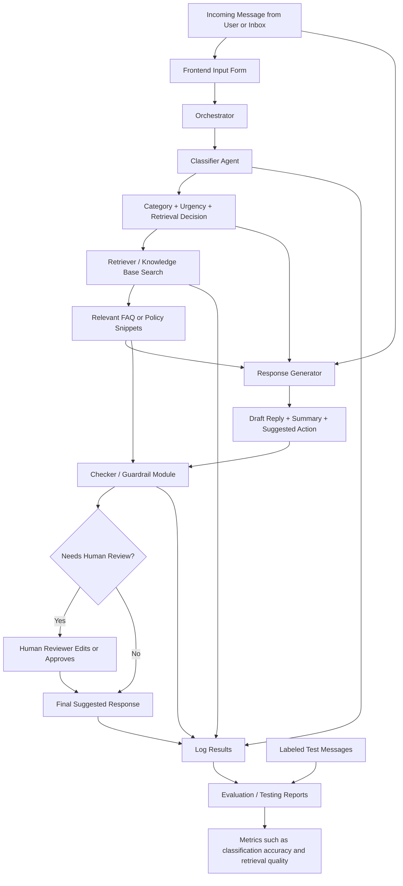

# AI Inbox Triage Assistant
## Final Project System Design Document

## 1. Project Overview

**Project Name:** AI Inbox Triage Assistant

**One-sentence description:**  
An AI-powered system that reads incoming support-style messages, classifies the issue, retrieves relevant policy information, drafts a response, and logs the result for review.

This project is designed for a student club, campus office, small team, or any organization that receives repetitive incoming messages such as questions about events, scheduling, access issues, refund requests, or technical problems.

Instead of acting like a generic chatbot, the system performs a practical workflow:

1. Accept a user message
2. Classify the message
3. Estimate urgency
4. Retrieve relevant internal knowledge
5. Draft a helpful response
6. Run a quality check
7. Present the result to a human reviewer

That makes the project more interesting than a basic study bot while still being realistic to build in a course setting.

---

## 2. Problem Statement

Small teams often receive many repetitive messages that still require human attention. Examples include:

- "I registered for the event but never got the Zoom link."
- "Can I still get a refund if I cancel now?"
- "When is the application deadline?"
- "I submitted my form but did not receive confirmation."
- "What time does the workshop start?"

These messages are often simple, but sorting them, checking policies, and drafting replies still takes time.

The goal of this system is to reduce that manual work by helping a human operator quickly understand each message and respond more consistently.

---

## 3. Why This Project Fits the Course Requirements

This project satisfies the course expectations in a clear way.

### Useful AI functionality
The system uses AI to:
- summarize incoming text
- classify the type of request
- estimate urgency
- retrieve relevant information
- generate a reply
- suggest next steps

### At least one advanced AI feature
This project includes **two** qualifying features:

#### 1. Retrieval-Augmented Generation (RAG)
Before generating a response, the system searches a local knowledge base such as:
- event policies
- refund rules
- scheduling information
- technical support FAQ
- contact details

The final response is grounded in retrieved information instead of relying only on the model's memory.

#### 2. Agentic Workflow
The system is not just a single prompt. It is a multi-step workflow:
- a classifier step
- a retrieval step
- a response generation step
- a checker step

Each stage has a different role in the pipeline.

### Reliability or testing system
The project can include:
- a labeled test set of example messages
- evaluation of classification accuracy
- logging of retrieved documents
- guardrails for unsafe or unsupported outputs

### Reproducibility and setup
The project can be built with a small, local dataset and a clear setup process so another person can run it.

---

## 4. Target Use Case

A human admin, club officer, or student worker pastes an incoming message into the application.

The system returns:
- issue category
- urgency level
- short summary
- retrieved supporting policy snippets
- recommended action
- draft response
- confidence or review flag

This is useful in settings like:
- student organizations
- campus help desks
- tutoring centers
- event management teams
- internship or application support inboxes

---

## 5. Core Features

### 5.1 Message Intake
The user enters a free-form message in a text box.

### 5.2 Message Classification
The AI labels the message into one of several categories, such as:
- Event Issue
- Schedule Question
- Refund Request
- Technical Problem
- General Information
- Urgent Complaint

### 5.3 Urgency Detection
The system estimates priority, for example:
- Low
- Medium
- High

A message mentioning that an event starts soon or that access is blocked could be marked high priority.

### 5.4 Retrieval from Knowledge Base
The system searches a structured local dataset for relevant information. This could be stored in:
- JSON
- CSV
- SQLite
- simple text files with metadata

Example entries might include:
- event access policy
- refund deadline rules
- workshop attendance instructions
- common technical troubleshooting steps

### 5.5 Drafted Reply
Using the retrieved information, the AI generates a response draft that is:
- concise
- professional
- grounded in known policies
- easy for a human to edit

### 5.6 Suggested Internal Action
The system also suggests what the handler should do next, such as:
- send Zoom link
- verify registration
- escalate to organizer
- issue refund form
- ask for missing details

### 5.7 Output Checking
A final checker step reviews whether:
- the response used retrieved evidence
- the answer sounds professional
- the answer avoids unsupported claims
- the case should be escalated for human review

### 5.8 Logging
The system logs:
- original message
- category
- urgency
- retrieved records
- final response
- timestamp
- whether human review was required

This supports transparency and debugging.

---

## 6. Example Input and Output

### Example Input
> Hi, I signed up for tonight's workshop but never received the Zoom link. It starts in 45 minutes. Can you help?

### Example Output
- **Category:** Event Issue
- **Urgency:** High
- **Summary:** User registered for a workshop but did not receive the Zoom link before the event start time.
- **Retrieved Knowledge:** Event access FAQ, registration confirmation policy
- **Suggested Action:** Verify registration and send event link immediately
- **Draft Reply:**  
  Hi, thanks for reaching out. I am sorry you did not receive the Zoom link. If you send the email address you used to register, we can verify your registration and send the access information right away.
- **Review Flag:** Human should verify registration before final send

---

## 7. System Components

The main components of the system are:

### 7.1 Frontend Interface
A simple UI where the human operator can:
- paste or type an incoming message
- submit it for analysis
- review the generated outputs

This can be built with:
- Streamlit
- Flask templates
- React if desired

For a class project, Streamlit is likely the fastest option.

### 7.2 Orchestrator
This is the main application logic that controls the order of operations:
1. receive input
2. call classifier
3. call retriever
4. call response generator
5. call checker
6. save logs
7. return results

### 7.3 Classifier Agent
This module determines:
- message category
- urgency level
- whether retrieval is needed
- whether the case should be escalated

### 7.4 Knowledge Base / Retriever
This component searches the stored internal information and returns the most relevant items.

Options:
- keyword search using TF-IDF
- embeddings-based similarity search
- simple cosine similarity over sentence embeddings

For a manageable course project, a lightweight retrieval method is enough.

### 7.5 Response Generator
This component uses:
- the original message
- the predicted category
- the urgency
- the retrieved policy text

It produces:
- a summary
- a suggested action
- a reply draft

### 7.6 Checker / Guardrail Module
This module reviews the generated response and checks for problems such as:
- unsupported policy claims
- missing retrieved evidence
- unprofessional tone
- missing escalation for urgent cases

### 7.7 Logger / Evaluator
This records each run and can also compare results against a labeled test set.

---

## 8. System Diagram

The following Mermaid diagram shows the main components, the data flow, and where human review and testing fit into the system.



---

## 9. Data Flow Explanation

The system follows a clear input → process → output structure.

### Input
The system receives a raw incoming message.

### Processing
The system then performs several steps:
1. classify the issue
2. estimate urgency
3. retrieve relevant information
4. generate a response draft
5. check the output
6. log the result

### Output
The final output shown to the human includes:
- category
- urgency
- summary
- retrieved context
- recommended action
- draft response
- review status

This structure directly matches the design and architecture requirement.

---

## 10. Human Involvement and Testing

The assignment specifically asks where humans or testing are involved. This project includes both.

### Human involvement
Humans are involved at the review stage:
- urgent messages can be flagged
- refund or policy-sensitive cases can require approval
- the final draft can be edited before use

This keeps the system safe and realistic.

### Testing involvement
A testing module can evaluate the system on a small labeled dataset.

Example test fields:
- sample message
- true category
- true urgency
- expected retrieved document
- notes on acceptable answer behavior

Possible evaluation metrics:
- classification accuracy
- urgency prediction accuracy
- retrieval relevance
- percentage of outputs correctly flagged for review

---

## 11. Recommended Tech Stack

A simple and practical stack would be:

### Frontend
- Streamlit

### Backend / Application Logic
- Python

### AI API
- OpenAI API or another supported LLM API

### Retrieval
- JSON or CSV knowledge base
- sentence-transformers or scikit-learn for basic retrieval

### Storage / Logging
- SQLite or CSV logs

### Evaluation
- Python scripts with pandas

This is enough to meet the requirements without becoming too large.

---

## 12. Suggested File Structure

```text
ai-inbox-triage/
├── app.py
├── requirements.txt
├── README.md
├── data/
│   ├── faq.json
│   ├── sample_messages.csv
│   └── test_set.csv
├── src/
│   ├── classifier.py
│   ├── retriever.py
│   ├── generator.py
│   ├── checker.py
│   ├── orchestrator.py
│   └── logger.py
├── logs/
│   └── app_logs.csv
└── eval/
    └── evaluate.py
```

---

## 13. Minimum Viable Product

To keep the project manageable, the MVP should include:

- one input text box
- category classification
- urgency detection
- retrieval over a small FAQ dataset
- response generation using retrieved context
- one checker step
- output display
- logging
- a small test set

This is enough to demonstrate RAG, workflow design, testing, and practical usefulness.

---

## 14. Stretch Features

If there is extra time, possible improvements include:

- confidence score display
- multiple retrieved documents with ranking
- sentiment detection
- auto-escalation to different staff roles
- email-style formatting
- admin dashboard for logs
- feedback buttons such as "useful" or "needs correction"

These are optional and not required for the core project.

---

## 15. Risks and Limitations

Some expected limitations include:
- retrieval may miss the best policy if the dataset is too small or poorly written
- the model may still produce vague language
- urgency estimates may sometimes be imperfect
- human review is still needed for high-stakes cases

These limitations are acceptable and can be discussed honestly in the final presentation.

---

## 16. Why This Project Is a Strong Choice

This project is a strong final project because it is:

- practical
- more original than a study bot
- realistic for a class project
- easy to explain in a demo
- clearly aligned with the rubric
- flexible enough to show real AI system design

It also gives you a chance to talk about modern AI ideas in a simple way:
- retrieval
- multi-step workflows
- guardrails
- evaluation
- human-in-the-loop systems

---

## 17. Final Summary

The AI Inbox Triage Assistant is a lightweight but meaningful AI system that helps process incoming messages by classifying them, retrieving relevant internal information, drafting a response, and supporting human review.

It satisfies the course requirements by combining:
- useful AI behavior
- retrieval-augmented generation
- agentic workflow structure
- testing and logging
- clear architecture and data flow

This makes it a strong, manageable, and interesting final project for AI 110.
